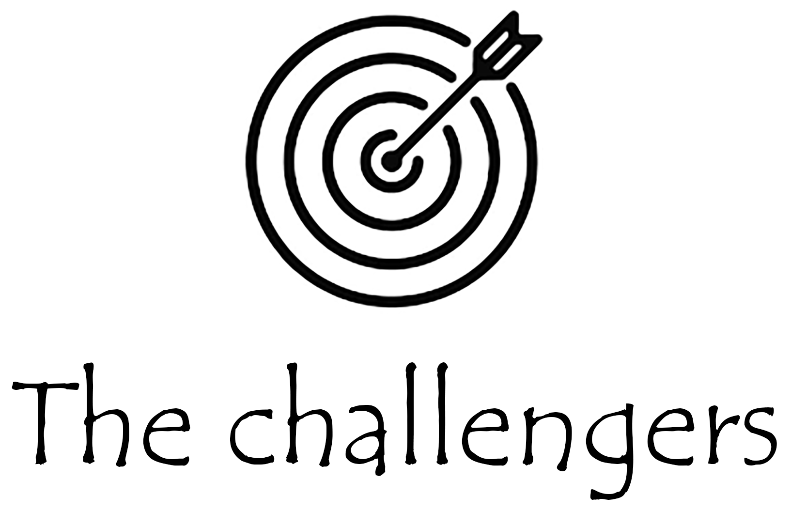

# Hi, we are team Challengers! 🎯

# Our team 🙋‍♀️🙋‍♂️:
- Dimitur Berdankov 10A *<DHBerdankov19@codingburgas.bg>* - QA
- Mirena Dzhebarova 10B *<MSDzhebarova19@codingburgas.bg>* - Frontend Developer
- Ivan Staev 10V *<IDStaev19@codingburgas.bg>* - Backend Developer
- Kameliya Yaneva 10G *<KKYaneva19@codingburgas.bg>* - Scrum Trainer

# Main idea of the project💡:
The idea of the project is to make a program that is related with historical events. We chose to focus on the bulgarian uprisings.
One of the main things that we focused on was the Gray code that we should've used in our program. We also had to use linked lists, so we did it by saving all uprisings as a linked list. We used C++ as main language.

In the program, there are 5 options:

> All events - shows all events  
> Add an event - option to add an event  
> Delete an event - option to delete an event  
> Quiz - where you can test your knowledge  
> Exit - end of program  

